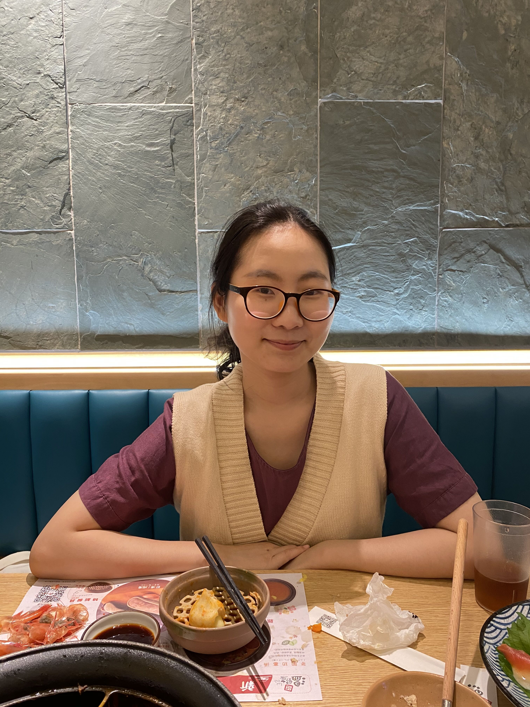

# hw01

## Basic Info

My name is Yunshu Hu, I am currently back home in Jinan, China. 

I am a rising third year undergraduate student majoring in economics.

Here is the most recent picture of me I can find in my phone. It is taken by my best friend.

## Fun Facts

Here are some fun facts about me:

* I love museums. Wherever I travel, I visit the local museums. My favorite museums so far are:
  * [The Palace Museum](https://en.dpm.org.cn/) in Beijing, China
  * [The Palace of Versailles](http://en.chateauversailles.fr/) in Versailles, France
  * And [*The Art Institute of Chicago*](https://www.artic.edu/)! 

* I gained 10 pounds after we started remote learning. Partly because my parents are so good at cooking. 

* The book I am currently reading is **The Great Game: The Emergence of wall Street as a World Power** by John Gordon.

* I miss my UChicago friends soooo much. 

